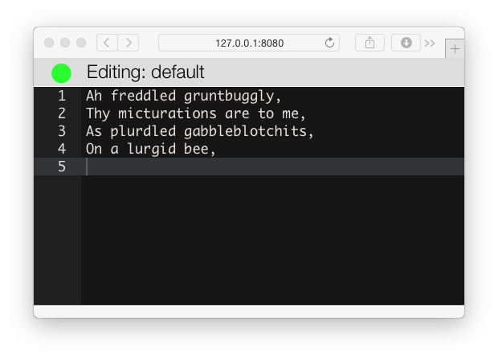

# WOOT with Scala.js

* Collaborative text editing, using the WOOT algorithm.
* Implemented in Scala, running on both the JVM and a JavaScript interpreter.

## For the Impatient

    $ sbt "project server" run

Then open _http://127.0.0.1:8080/_ to edit a document.

Open another browser at the same address, and you'll get the idea of collaboration.

## What is WOOT?

WOOT is a collaborative text editing algorithm, allowing multiple users ("sites") to insert or delete characters (`WChar`) from a shared document (`WString`). The algorithm preserves the intention of users, and ensures that the text converges to the same state for all users.

Its key properties are simplicity, and avoiding the need for a reliable network or vector clocks (it can be peer-to-peer).

The key references are:

* Oster _et al._ (2005) _Real time group editors without Operational transformation_, report paper 5580, INRIA - [PDF](http://www.loria.fr/~oster/pmwiki/pub/papers/OsterRR05a.pdf)

* Oster _et al._ (2006) _Data Consistency for P2P Collaborative Editing_, CSCW'06 - [PDF](http://hal.archives-ouvertes.fr/docs/00/10/85/23/PDF/OsterCSCW06.pdf)

WOOT stands for With Out [Operational Transforms](https://en.wikipedia.org/wiki/Operational_transform).


## This Project

This project contains a Scala implementation of WOOT,
which has also been compiled to JavaScript using Scala.js.

The project is an example of sharing one implementation (the WOOT model)
in both a JavaScript and Scala context.

The editor is [ACE](http://ace.c9.io/), which is wired up to the
Scala.js implementation of WOOT locally within the browser.
Updates are sent over a web socket to a server which also maintains a copy of the model, but on the JVM.




## What Happens When You Run the Web Server

Running the sever code will likely produce:

```
$ sbt "project server" run
[info] Loading global plugins from ...
[info] Loading project definition from wootjs/project/project
[info] Loading project definition from wootjs/project
[info] Set current project to woot
[info] Set current project to woot-server
[info] Fast optimizing wootjs/client/target/scala-2.11/woot-client-fastopt.js
[info] Running Main
2015-04-08 13:43:52 [run-main-0] INFO  WootServer - Starting Http4s-blaze WootServer on '0.0.0.0:8080'
...
```

Notice that the Scala.js compiler has run on the _woot-client_ project, to convert the client Scala code into JavaScript.  This JavaScript, _woot-client-fastopt.js_, is made available on the classpath of the server, so it can be included on the web page.  The web page is _server/src/main/resources/index.html_.

This reflects the structure of the project:

* _client_ - Scala source code, to be compiled to JavaScript.
* _server_ - Scala source code to run server-side, plus other assets to be served, such as HTML, CSS and plain old JavaScript.
* _woot-model_ - Scala source code shared by both the client and server projects. This is the WOOT algorithm, implemented once, used in the JVM and the JavaScript runtime.


## Tests

The tests for this project are implemented as [ScalaCheck](http://www.scalacheck.org/) properties.

### Running the tests in the JVM

   sbt> project server
   sbt> test

### Running the tests in a JavaScript interpreter

   sbt> project client
   sbt> test

### Code Coverage

    sbt> project coverage
    sbt> coverage
    sbt> test

Then open _woot-model/target/scala-2.11/scoverage-report/index.html_

## Reference

* [Exporting Scala.js APIs to JavaScript](http://www.scala-js.org/doc/export-to-javascript.html)
* [Calling JavaScript from Scala.js](http://www.scala-js.org/doc/calling-javascript.html)
* [Semantics of Scala.js](http://www.scala-js.org/doc/semantics.html) - exceptions to the rule that Scala.js prorgrams behave the same as Scala on the JVM.
* [JavaScript interoperability ](http://www.scala-js.org/doc/js-interoperability.html) - including a list of [opaque types](http://stackoverflow.com/questions/27821841/working-with-opaque-types-char-and-long).
* [µPickle 0.2.8](http://lihaoyi.github.io/upickle/) - the JVM and JavaScript JSON/case class serialization library used in this demo.
* [http4s](http://http4s.org/) - the server used in this demo.

## Scala.js Learning Path

If you're new to Scala:

* [Creative Scala](http://underscore.io/training/courses/creative-scala/) - a free course from Underscore teaching Scala using drawing primitives backed by Scala.js.

And then...

* [Scala-js.org Tutorial](http://www.scala-js.org/doc/tutorial.html)
* [Hands-on Scala.js](http://lihaoyi.github.io/hands-on-scala-js/#Hands-onScala.js)
